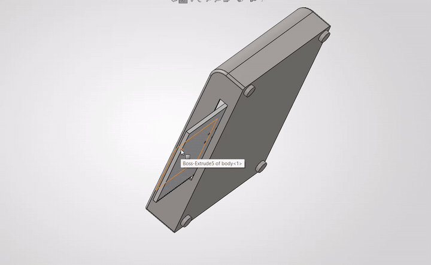
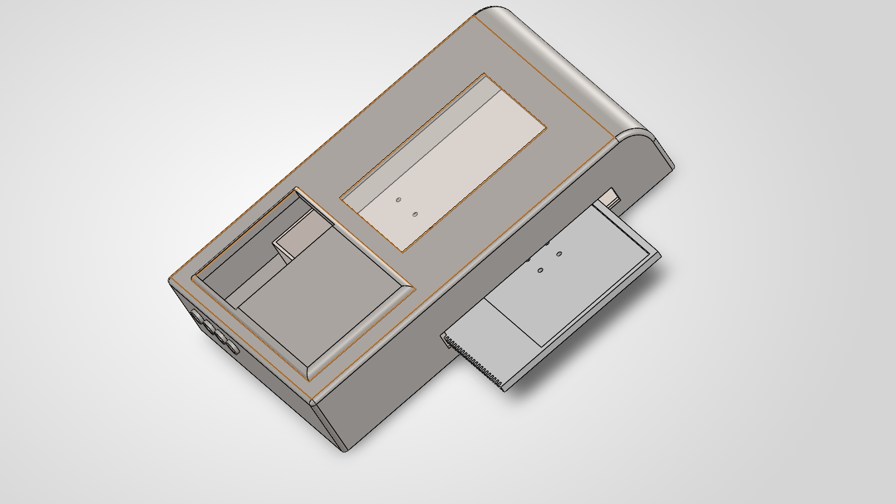
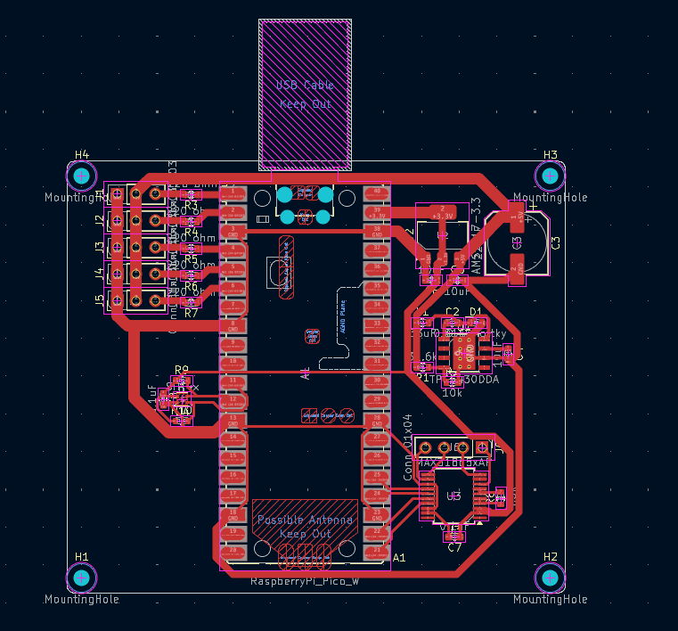
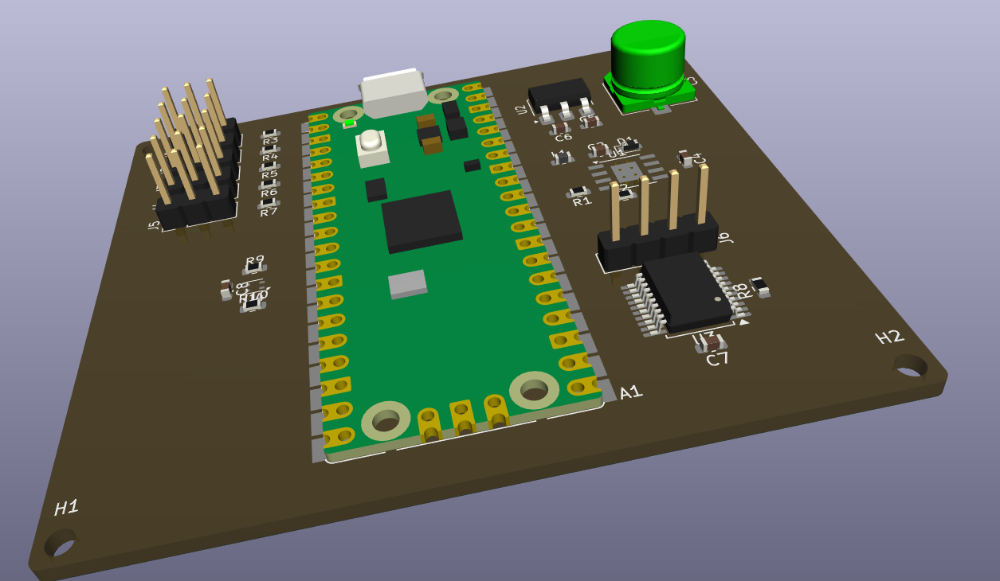
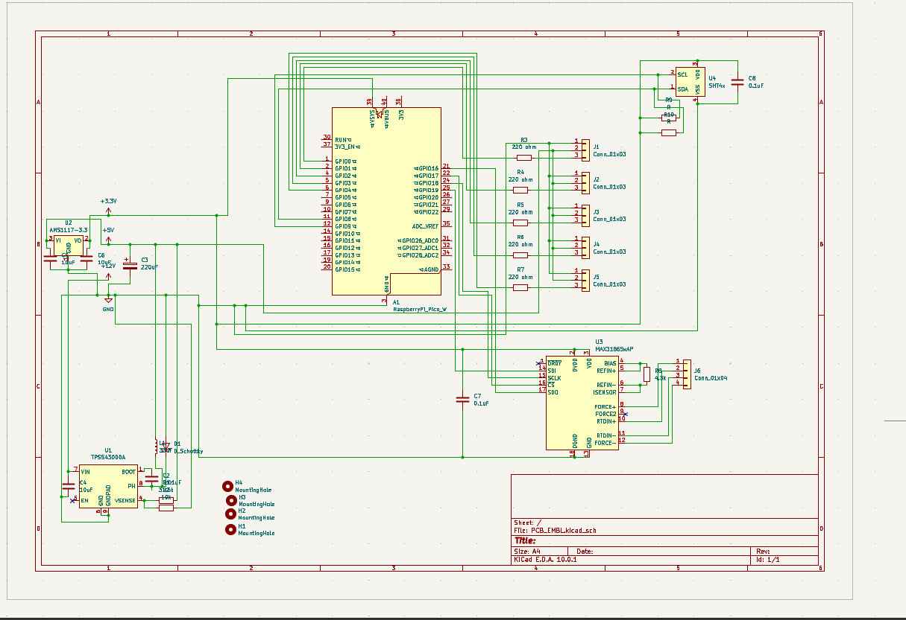
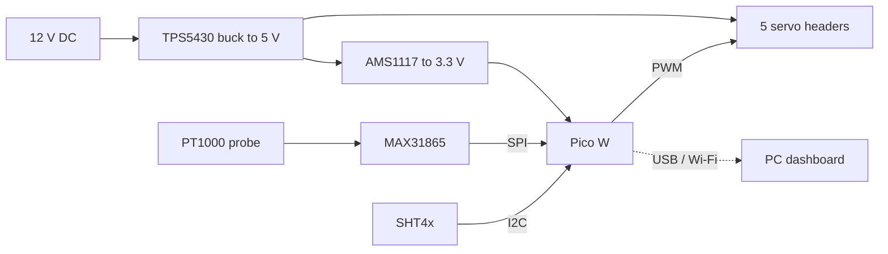

# Bench-Top Cell Incubator

**An automated stage-top incubator for live-cell imaging of stem cells: custom control PCB, rack-and-pinion plate carriage, firmware and PC dashboard.**



<sub>SolidWorks walkthrough of the shell, chamber and ejecting tray (loops automatically). [Full-quality video](assets/video/incubator_cad_walkthrough_full.mp4).</sub>

## What this is

Live-cell time-lapse imaging needs cells held at physiological conditions (37 C, 5 % CO2, high humidity) on the microscope stage for days.
Full-microscope enclosures are large and expensive. This project is a compact **stage-top incubator** that sits on the stage of an inverted microscope.

Its key feature is an **automated tray**: a motor-driven rack and pinion ejects and retracts a standard 96-well plate, so media changes or robotic liquid handling can happen without disturbing the chamber or the optical alignment.

It was built as a mechatronics and software project in support of an internship application (small cell incubator with temperature, CO2 and N2 control, automatic sample insertion and removal, and C++/Python control software).

## Project status

| Area | Status |
|---|---|
| Control PCB (schematic, DRC) | Complete |
| PCB layout | Routed; ground pour and file export pending |
| Temperature and humidity sensing | Designed |
| 5-channel servo output | Designed |
| Mechanical CAD (SolidWorks) | Almost done; final work waits on lab input (below) |
| Firmware and PC dashboard | Written, sensor maths unit-tested; hardware testing pending |
| CO2 and N2 control | Not on the PCB; assumed external for now |
| Physical build and biological validation | Planned: [validation plan](docs/test_plan.md) |

Full list in [docs/roadmap.md](docs/roadmap.md).

## Mechanical design


| Rack on the carriage tray | Motor bracket and pinion |
|---|---|
|  |  |



- **Outer shell:** unibody enclosure with an offset viewing window for inverted microscopy, a lateral ejection port and an IEC power switch. An opaque "side-car" cavity keeps the drive and electronics apart from the humid zone.
- **Inner chamber and tray:** the tray holds a 96-well plate and has a linear rack along one edge.
- **Drive:** a pinion meshes with the rack. A motor bracket holds the actuator away from the heated zone.
- **Fabrication:** FDM printing. PETG or ABS for structure, nylon or POM for gears, and a 1 mm polycarbonate or glass window.

Details: [docs/mechanical.md](docs/mechanical.md).

## Electronics

| Routed layout | 3D render |
|---|---|
|  |  |



The board is built around a **Raspberry Pi Pico W** and powered from 12 V DC through a two-stage supply: a TPS5430 buck converter (5 V, up to 3 A, for actuators) followed by an AMS1117 LDO (3.3 V, for logic and sensors). High-current switching nodes are kept away from the analog sensing area.



### Sensors and what they do

| Sensor | Measures | Details |
|---|---|---|
| PT1000 RTD + MAX31865 | Chamber temperature (target 37.0 C) | 4-wire ratiometric measurement removes lead-wire error; 4.3 kohm 0.1 % reference resistor; SPI |
| SHT4x | Relative humidity (target about 95 %) | Digital, +/-1.5 % RH typical; I2C at 0x44 |
| CO2 sensor (planned) | 5 % CO2 | Depends on the gas route |
| N2 / O2 (planned) | Hypoxia control | Depends on the gas route |

### Pin map

| Function | Pico W pin |
|---|---|
| SPI (MAX31865): MISO / CS / SCK / MOSI | GPIO16 / 17 / 18 / 19 |
| I2C (SHT4x): SDA / SCL | GPIO8 / 9 |
| Servo PWM, headers J1 to J5 | GPIO0 to GPIO4 (220 ohm series resistors) |

More in [docs/electronics.md](docs/electronics.md); parts list in [hardware/pcb/bom.csv](hardware/pcb/bom.csv); PCB documentation PDF in [hardware/pcb/docs/](hardware/pcb/docs/).

## Software

- **Firmware** (`firmware/pico/`, MicroPython): MAX31865 and SHT4x drivers, servo-driven tray eject/retract with a smooth ramp, a PID loop (heater output is optional because the board has no heater driver yet), and JSON telemetry over USB serial.
- **Dashboard** (`software/gui/`, PyQt5): live temperature and humidity, tray control, setpoint, CSV logging.
- **Tests** (`firmware/tests/`): the PT1000 conversion, SHT4x CRC and conversion, and PID clamping run on a PC.

```bash
# unit tests (no hardware needed)
python -m unittest discover firmware/tests

# flash firmware: copy firmware/pico/*.py to the Pico W (for example with mpremote or Thonny), then:
pip install -r software/requirements.txt
python software/gui/incubator_gui.py --port COM5      # or /dev/ttyACM0
```

Heads-up: the firmware and dashboard have not yet been run on the assembled hardware. Tray angles and PID gains in `config.py` and `main.py` are placeholders to calibrate.

## Repository layout

```text
assets/        images and the CAD walkthrough video (GIF + MP4)
docs/          electronics, mechanical, test plan, roadmap, design review notes
hardware/
  pcb/         KiCad project and schematic, BOM, PCB documentation PDF
  cad/         SolidWorks assembly and design proposal PDF
firmware/      MicroPython code for the Pico W, plus PC unit tests
software/      PyQt5 dashboard (and a placeholder for the image pipeline)
```

## Open questions for the lab

These three answers decide the final CAD ([details](docs/roadmap.md)):

1. Should the incubator be screwed to the microscope stage, or rest on it?
2. How are CO2 and N2 supplied: an existing external mixer (fittings only), or valves controlled by this device?
3. Should the control PCB live inside the side-car cavity, or in an external control box?

## Fit with the internship brief

| Requirement | Where it shows up here |
|---|---|
| Design a small incubator (temperature, CO2, N2) | Temperature and humidity sensing and the chamber design are done; CO2/N2 are scoped as external ([roadmap](docs/roadmap.md)) |
| Automatic sample insertion and removal | Rack-and-pinion tray CAD and servo tray control |
| Control software in C++ and Python | MicroPython firmware and a PyQt5 dashboard (C++/Arduino version is a possible port) |
| Electronics and soldering | Custom KiCad PCB with buck, LDO, RTD front-end and I2C sensor |
| 3D design and printing | SolidWorks assembly with an FDM print plan |
| Test with biological samples over days | [Validation plan](docs/test_plan.md) |
| Work with biologists | The open questions above are written for the lab |

Stepper motors: the current board drives hobby servos. A stepper-based tray drive is listed as the next step in the [roadmap](docs/roadmap.md).

## Known limitations

A self-review of the current schematic is in [docs/design_review_notes.md](docs/design_review_notes.md).

## Author

Aryan, ECE student at USICT. GitHub: [@AryanPROFFESOR](https://github.com/AryanPROFFESOR).

## License

[MIT](LICENSE)
