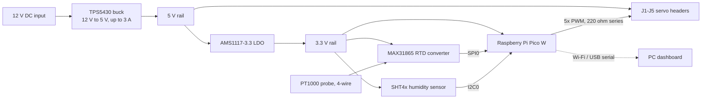

# Electronics: control PCB

Source: `hardware/pcb/kicad/` (KiCad 10 schematic and project) and `hardware/pcb/docs/PCB_Hardware_Documentation.pdf`.

## Block diagram

## Microcontroller
Raspberry Pi Pico W (A1): PWM for the actuators, SPI/I2C sensor reads, USB serial and Wi-Fi telemetry.

## Pin map

| Function | Pico W pin | Connected to |
|---|---|---|
| SPI0 MISO | GPIO16 | MAX31865 SDO |
| SPI0 CS | GPIO17 | MAX31865 CS |
| SPI0 SCK | GPIO18 | MAX31865 SCLK |
| SPI0 MOSI | GPIO19 | MAX31865 SDI |
| I2C0 SDA | GPIO8 | SHT4x SDA (10 k pull-up) |
| I2C0 SCL | GPIO9 | SHT4x SCL (10 k pull-up) |
| PWM 1-5 | GPIO0-GPIO4 | J1-J5 signal pin, each through 220 ohm (R3-R7) |

## Sensors and what each one is for

| Sensor | Part | Measures | Why this part | Interface |
|---|---|---|---|---|
| Chamber temperature | PT1000 Class A RTD + MAX31865 (U3) | Temperature at the 37.0 C target | Linear, stable, and 4-wire sensing removes lead-wire error. A 4.3 kohm 0.1 % reference resistor (R8) sets the ratiometric scale for a PT1000. | SPI0, header J6 |
| Humidity | Sensirion SHT4x (U4) | Relative humidity (target about 95 %) and a second temperature reading | Digital, factory-calibrated, typical RH accuracy +/-1.5 %. | I2C0, address 0x44 |
| CO2 (planned, external) | not selected | 5 % CO2 target | Needs a decision on the gas route (see [roadmap](roadmap.md)). | not on this PCB |
| N2 (planned, external) | not selected | Hypoxia / O2 displacement | Same dependency as CO2. | not on this PCB |

## Power architecture

| Stage | Part | Role | Key passives |
|---|---|---|---|
| 1 | TPS5430DDA buck (U1) | 12 V to 5 V, up to 3 A, for the actuators | C4 10 uF input, C2 0.01 uF bootstrap, D1 Schottky catch diode, L1 33 uH, C3 220 uF output |
| 2 | AMS1117-3.3 LDO (U2) | Clean 3.3 V for logic and sensors, kept away from the motor rail | C5 10 uF in, C6 10 uF out |

Feedback divider R1 31.6 kohm / R2 10 kohm sets the buck output near 5 V (1.221 V reference x (1 + 31.6/10) is about 5.08 V).
Local decoupling: C7 0.1 uF on the MAX31865, C8 0.1 uF on the SHT4x.

## Layout intent
High-current switching nodes (buck, inductor, diode) are kept physically apart from the analog RTD front-end. A USB keep-out and a Wi-Fi antenna keep-out are respected around the Pico W module.
See `assets/images/pcb/` for the routed layout and 3D render.

## Servo outputs
J1-J5 are 3-pin headers (5 V, GND, signal). The 220 ohm series resistor limits current into the Pico GPIO if a servo signal line misbehaves.
