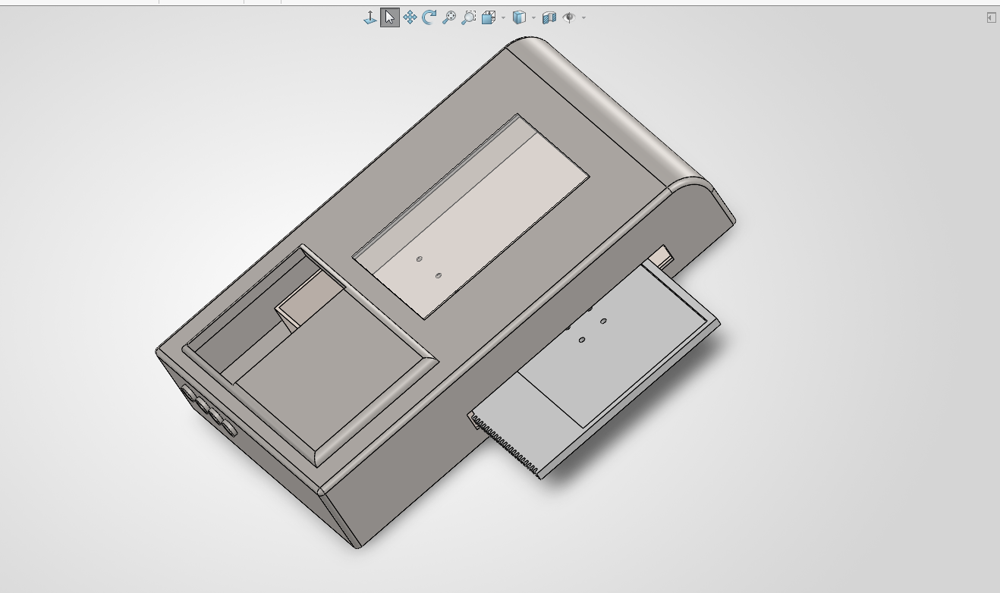
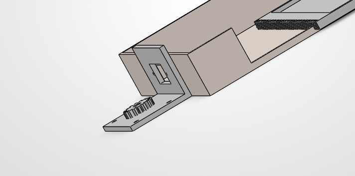
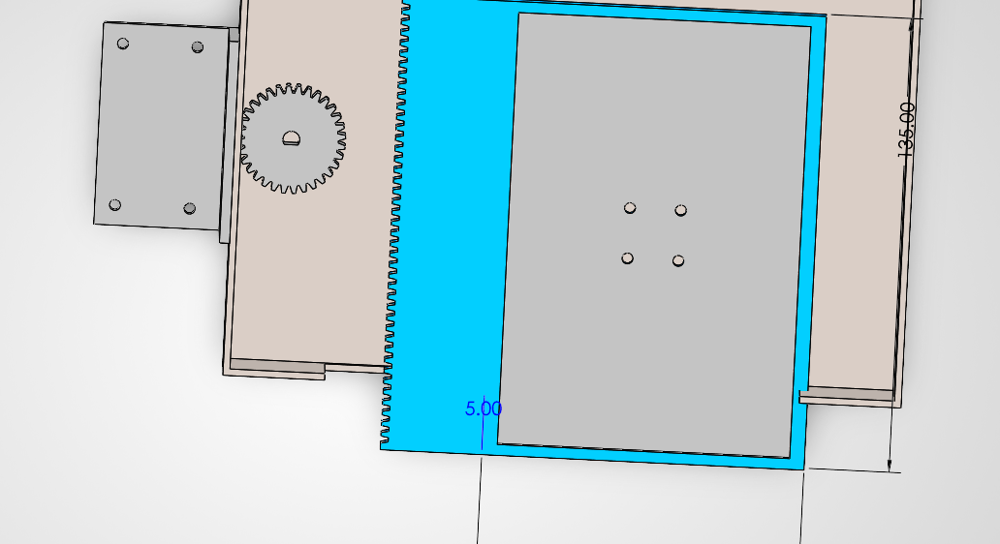

# Mechanical design

CAD: SolidWorks 2026 (`hardware/cad/solidworks/Main_Incubator_Assembly.SLDASM`).
The assembly references part files that are not in this repo yet; see `hardware/cad/README.md`.
Design write-up: `hardware/cad/Mechanical_Design_Proposal.pdf`.

## Concept
A stage-top incubator that sits on an inverted microscope stage and holds mammalian cell cultures at physiological conditions while imaging.
The main feature is a rack-and-pinion carriage: a standard 96-well plate can be ejected and retracted by a motor,
so media can be changed (manually or by a liquid-handling robot) without opening the chamber to room air.

## Parts

| Part | Description |
|---|---|
| Motor bracket | L-shaped bracket, four mounting holes, keeps the actuator away from the heated zone. |
| Inner chamber base and carriage tray | Containment floor with a sliding tray for a 96-well plate. The tray has an integrated linear rack along one edge. |
| Drive | Rotary pinion meshing with the tray rack, turning rotation into linear tray travel. |
| Outer shell and internal cavity | Unibody enclosure with an offset viewing window (for inverted microscopy), a lateral ejection port and an IEC power switch module. The opaque section forms a "side-car" cavity that separates drive and electronics from the humid zone. |
| Optical window | 1 mm polycarbonate or glass insert, cut and sealed by hand. Clear FDM filament is not used because it lacks the optical quality. |

| | |
|---|---|
|  |  |

## Fabrication plan (FDM)
- Shell, chamber, bracket: PETG or ABS (stable at a sustained 37 C).
- Gears: nylon or POM (acetal) for low friction and wear.
- Window: 1 mm polycarbonate or glass, sealed.

## Open mechanical decisions
1. Mount to the microscope stage with screws/flanges, or rest passively on the translation stage?
2. Gas routing: push-to-connect fittings to an external CO2/N2 mixer, or on-board valves?
3. Electronics: inside the side-car cavity, or in an external control box?

These are tracked in [roadmap.md](roadmap.md).
